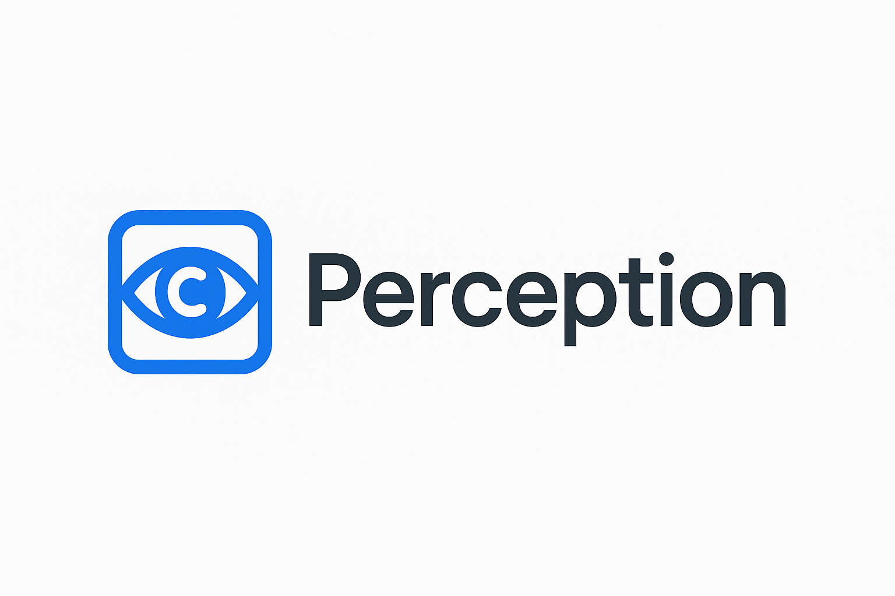

# Perception 

  

<h1 align="center">Perception</h1>

<b>Business First Computer Vision Dashboard</b>

---

## Overview

Perception is a business-first computer vision dashboard focused on turning raw visual data into clear, actionable insights for operators, analysts, and decision-makers. Instead of centering on models and infrastructure, Perception is built around the metrics, workflows, and outcomes that matter to the business.

## Key Capabilities

- **Business-first views**
  Dashboards, KPIs, and alerts are organized around business questions (efficiency, safety, conversion, quality), not just technical metrics.

- **Visual intelligence at a glance**
  Summaries, trend lines, and breakdowns help you quickly understand what is happening across locations, cameras, and time.

- **Configurable dashboards**
  Flexible panels, filters, and layouts so teams can tailor the UI to their role (operations, product, data, leadership).

- **Event- and insight-centric**
  Focuses on events, anomalies, and patterns rather than raw frames, making it easier to act on what matters.

- **Collaboration-friendly**
  Designed for sharing views, exporting insights, and aligning stakeholders around a single visual source of truth.

## Example Use Cases

- **Retail & QSR**
  Measure foot traffic, queue times, conversion, and in-store behavior to optimize layouts and staffing.

- **Industrial & Logistics**
  Monitor throughput, bottlenecks, and safety compliance on production lines, warehouses, and yards.

- **Smart Buildings & Offices**
  Understand occupancy, utilization, and flows to improve comfort, safety, and space planning.

- **Security & Safety**
  Turn detections and alerts into understandable, high-level insights that can be triaged and resolved quickly.

## Project Structure (High Level)

- **apps/web**
  Main web-based dashboard experience and public assets (including `perception.png`).

Additional services, models, and infrastructure live in the rest of the repository and can be organized to match your deployment and data stack.

## Getting Started

Use this section as a high-level guide to running the dashboard in your environment. Exact commands and tooling may depend on how you bootstrap the project.

1. **Clone the repository**
   - Add this project to your workspace or clone it locally.

2. **Install dependencies**
   - Install dependencies for the web dashboard in `apps/web` and any related services.

3. **Configure environment**
   - Set environment variables and configuration for your data sources, camera feeds, or event streams.

4. **Run the dashboard**
   - Start the web app in development mode and connect it to your backend and vision services.

5. **Deploy**
   - Deploy the dashboard using your preferred platform (container-based, serverless, on-prem, etc.).

## Design Principles

- **Business outcomes first**
  Every chart, metric, and view should map to a clear business question or decision.

- **Clarity over complexity**
  Hide unnecessary technical details from non-technical users while keeping depth available for experts.

- **Explainable visuals**
  Make it obvious what each metric represents and how it is derived from underlying computer vision signals.

- **Composable building blocks**
  Treat dashboards, tiles, and filters as building blocks that can be recombined for different teams and use cases.

## Contributing

If you are extending Perception or integrating it into your stack:

- **Open issues** for bugs, enhancements, or questions.
- **Propose improvements** to dashboards, UX flows, or metrics definitions that better reflect real business needs.
- **Document integrations** (data sources, event pipelines, model outputs) so other collaborators can reuse them.

## Notes

This README focuses on the product framing and high-level experience. For implementation details (frameworks, data pipelines, deployment, etc.), refer to the code, internal docs, or architecture diagrams within the repository.